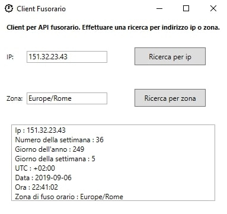

# Architettura e scelte implementative
L'applicazione viene sviluppata in linguaggio *PHP*.
Non si fa uso di librerie o moduli aggiuntivi.

## Autenticazione
Come servizio di autenticazione viene utilizzato l'header http.
Per cui, si dovranno specificare le credenziali secondo l'header *WWW-Authenticate*.
Nell'utilizzo dell'api da browser, comparirà un pop-up in cui inserire le credenziali.

  

## Formato dei dati
Il formato dei dati in output è di tipo JSON e gli schemi utilizzati vengono descritti nella [documentazione API](documentazione_api.md).

## Database
Per lo sviluppo di alcune funzionalità del servizio è stato necessario l'utilizzo di un database. 
In particolare, viene utilizzato per memorizzare dati della chat di telegram, in modo da rendere
la conversazione più interattiva, e far ricordare al bot il testo inserito in precedenza.
Inoltre il database memorizza tutte le credenziali a cui viene permesso l'utilizzo dell'api.
Sono state create quindi due tabelle, una tabella *account* e una *chat_id*.

  
   

E' stato utilizzato il DBMS [PostgreSQL](http://postgresql.org), offerto dalla piattaforma [Heroku](http://heroku.com).

## Telegram

Un client del servizio API è un bot realizzato sulla piattaforma di messaggistica [Telegram](http://telegram.org).
Per la creazione del bot si rimanda alla guida ufficiale : [come creare un bot su telegram](http://core.telegram.org/bots#3-how-do-i-create-a-bot).
Contattando il [BotFather](http://telegram.me/botfather) sono stati aggiunti dei comandi come pulsanti rapidi.

Per l'utilizzo del bot telegram si rimanda alla documentazione [guida all'uso](guida_all_uso.md).

## Client c#

Un altro client del servizio è stato sviluppato in c# utilizzando la piattaforma [WPF](https://it.wikipedia.org/wiki/Windows_Presentation_Foundation).
Per effettuare la richiesta all'api è stata utilizzata la libreria [RestSharp](http://restsharp.org/), mentre
per deserializzare il formato JSON dei dati è stata utilizzata la libreria [Json.net](https://www.newtonsoft.com/json).
Questo client ci consente di richiedere il fuso orario dato un indirizzo ip o una zona geografica.
Per l'utilizzo del client c# si rimanda alla documentazione [guida all'uso](guida_all_uso.md).

