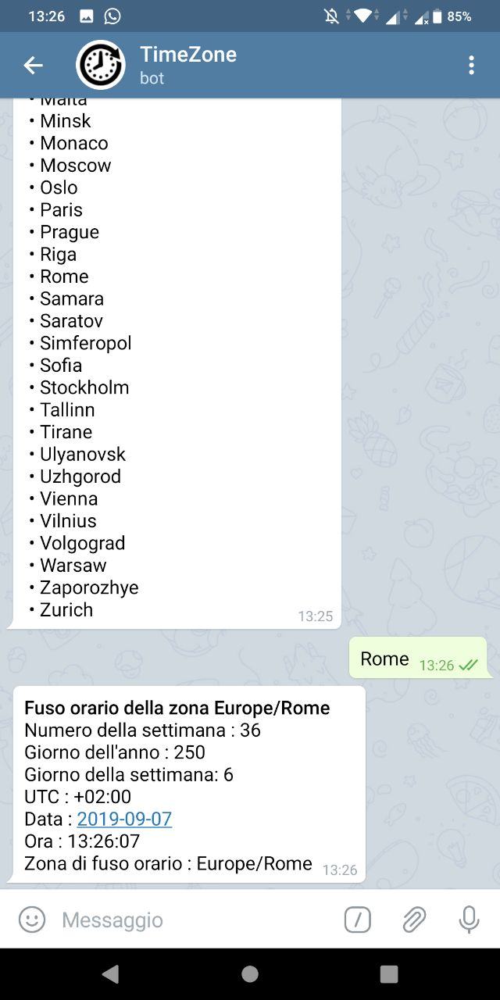
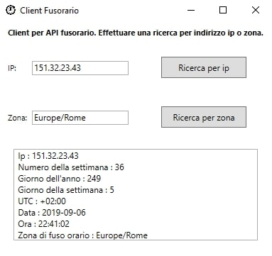

# Guida all'uso

## Guida all'uso di una conversazione telegram
Per avviare una conversazione telegram con il bot, aggiungerlo cercando '*fusorario_bot*' o tramite il seguente link [fusorario_bot](https://t.me/fusorario_bot).

### Avvio del bot
Per avviare il bot, basterà premere il pulsante "Avvia" per essere accolti dal messaggio di benvenuto.
Per visualizzare i comandi, si dovrà premere il pulsante "/" o inziare un messaggio con quest'ultimo carattere.

  
  

### Stampa della lista delle zone di fuso orario
Per stampare una lista delle zone di fuso orario, si dovrà digitare il comando **/list_timezone**.
Il bot visualizzerà tutte le zone, divise in più messaggi per area.

  

### Stampa del fuso orario di una zona
Per visualizzare le informazioni di fuso orario di una determinata zona, si dovrà digitare il comando **/timezone_from_location**.
Si dovrà inserire prima un'area fra quelle elencate, e poi la località.
Il bot visualizzerà tutti i dati relativi al fuso della zona specificata.

  
  

### Stampa del fuso orario da un indirizzo ip
Per visualizzare le informazioni di fuso orario di una determinata zona ricavata dalla geolocalizzazione di un indirizzo ip, si dovrà digitare il comando **/timezone_from_an_ip**.
Il bot visualizzerà tutti i dati relativi al fuso della zona dell'indirizzo di rete.

  

## Guida all'uso del client c#
Il client come applicazione desktop per windows ha una interfaccia banale e intuitiva.
Dalla finestra principale si potrà inserire o un indirizzo ip, o una zona di fuso, e fare click sul relativo pulsante.
Le informazioni di fuso orario compariranno nell'area di testo sottostante.

  

